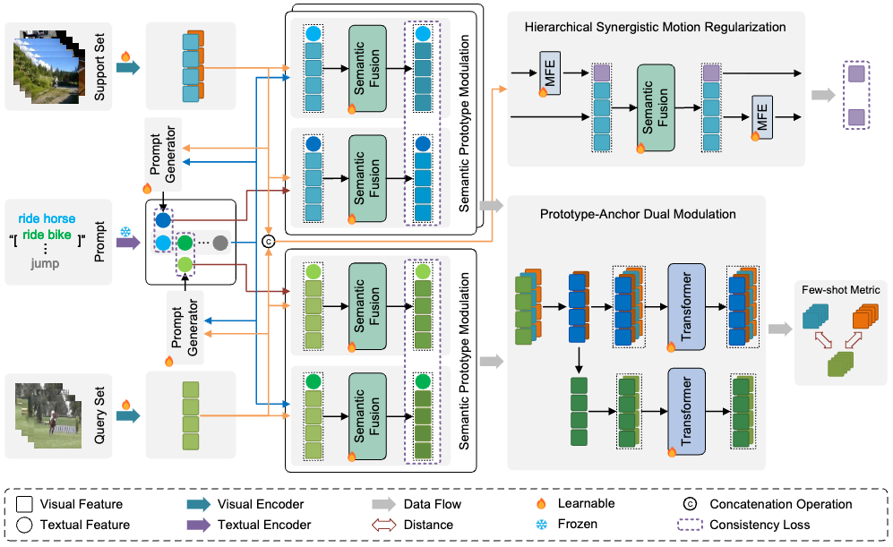

# Distinguishing Visually Similar Actions: Prompt-Guided Semantic Prototype Modulation for Few-Shot Action Recognition

## Project Overview

### Research Background
Distinguishing visually similar actions is a key challenge in few-shot action recognition. Existing methods often rely on visual feature similarity matching while ignoring the semantic information of actions, resulting in performance degradation when handling visually similar but semantically different actions. To address this issue, we propose a prompt-guided semantic prototype modulation approach that leverages semantic information to enhance the discriminability of visual features.

### Novelty
1. **CLIP-SPM Cross-Modal Framework**: We propose the CLIP-SPM cross-modal framework to jointly tackle three central FSAR challenges: robust temporal modeling, fine-grained visual similarity, and the support-query modality gap.
2. **Hierarchical Synergistic Motion Refinement (HSMR) Module**: We design an HSMR module that explicitly extracts both shallow and deep motion features, enforcing consistency between these levels to capture stable motion patterns under scarce supervision.
3. **Semantic Prototype Modulation (SPM) Strategy**: We develop an SPM strategy that learns query-relevant textual prompts from episode context to bridge the modality gap. SPM modulates visual features by leveraging semantic guidance from textual features, enhancing discriminability between visually similar actions.
4. **Prototype-Anchor Dual Modulation (PADM) Method**: We introduce a PADM method that jointly refines support-side prototypes and aligns query features to a global anchor, yielding stronger cross-set consistency and more discriminative prototypes.

### Main Contributions
1. Proposed a new few-shot action recognition framework that effectively distinguishes visually similar actions
2. Designed a prompt-guided semantic prototype modulation mechanism that achieves deep fusion of semantic and visual information
3. Achieved excellent performance on multiple benchmark datasets, demonstrating the effectiveness and generalization ability of the method

All code will be open-sourced upon paper acceptance.

## Architecture



## Experimental Results

### Dataset Information
We evaluated our model on five widely used few-shot action recognition benchmarks:

| Dataset     | Total Classes | Train/Val/Test Classes | Train Videos | Val Videos | Test Videos | Total Videos | Split Method | Special Notes |
|-------------|---------------|------------------------|--------------|------------|-------------|--------------|--------------|---------------|
| Kinetics    | 100           | 64/12/24               | 6,400        | 1,200      | 2,400       | 10,000       | CMN          | 100 samples per class |
| SSv2-Full   | 174           | 64/12/24               | 77,500       | 1,926      | 2,854       | 82,280       | OTAM         | Uses all available samples per class |
| SSv2-Small  | 100           | 64/12/24               | 6,400        | 1,200      | 2,400       | 10,000       | CMN-J        | 100 samples per class |
| UCF101      | 101           | 70/10/21               | 9,154        | 1,421      | 2,745       | 13,320       | ARN          | - |
| HMDB51      | 51            | 31/10/10               | 4,280        | 1,194      | 1,292       | 6,766        | ARN          | - |

### Comparison Results

We comprehensively evaluated the CLIP-SPM model on five benchmark datasets using CLIP-RN50 and CLIP-ViTB16 as base models. Here are the performance comparisons under different shot settings:

#### CLIP-RN50 Base Model
| Dataset     | 1-shot | 3-shot | 5-shot |
|-------------|--------|--------|--------|
| HMDB51      | 77.4   | 82.6   | 84.5   |
| UCF101      | 93.8   | 97.2   | 97.7   |
| Kinetics    | 90.9   | 92.9   | 93.5   |
| SSv2-Full   | 62.3   | 67.0   | 69.4   |
| SSv2-Small  | 50.8   | 54.9   | 58.5   |

#### CLIP-ViTB16 Base Model
| Dataset     | 1-shot | 3-shot | 5-shot |
|-------------|--------|--------|--------|
| HMDB51      | 78.2   | 86.3   | 88.6   |
| UCF101      | 96.2   | 98.2   | 98.7   |
| Kinetics    | 92.8   | 94.1   | 94.3   |
| SSv2-Full   | 66.7   | 74.8   | 77.3   |
| SSv2-Small  | 57.8   | 62.4   | 66.2   |

**Note**: All results in the table represent the performance of the CLIP-SPM model on each dataset, with data sourced from experimental result statistics.

## Project Structure

```
CLIP-SPM/
├── configs/                  # Configuration files
│   ├── clipspm/              # CLIP-SPM model configuration
│   ├── clipfsar/             # CLIP-FSAR model configuration
│   ├── cpm2c/                # CPM2C model configuration
│   ├── otam/                 # OTAM model configuration
│   └── base.yaml             # Base configuration
├── models/                   # Model definitions
│   ├── model_clipspm.py      # CLIP-SPM model implementation
│   ├── model_clipfsar.py     # CLIP-FSAR model implementation
│   ├── model_cpm2c.py        # CPM2C model implementation
│   ├── model_otam.py         # OTAM model implementation
│   └── clip_fsar.py          # CLIP base model
├── run/                      # Running scripts
│   ├── run.py                # Main running script
│   └── main_run.py           # Training and testing logic
├── splits/                   # Dataset split files
│   ├── hmdb_ARN/             # HMDB51 dataset splits
│   ├── ssv2_CMN/             # SSv2-CMN dataset splits
│   ├── ssv2_OTAM/            # SSv2-OTAM dataset splits
│   └── ucf_ARN/              # UCF101 dataset splits
├── utils/                    # Utility functions
│   ├── config.py             # Configuration file processing
│   └── utils.py              # General utility functions
├── videotransforms/          # Video transforms
│   ├── video_transforms.py   # Video spatial transforms
│   └── volume_transforms.py  # Video temporal transforms
├── requirements.txt          # Dependencies list
├── train_test.sh             # Training and testing script
└── README.md                 # Project documentation
```

## Environment Setup

### Installation Steps

1. **Clone the repository**
   ```bash
   git clone https://github.com/your-username/CLIP-SPM.git
   cd CLIP-SPM
   ```

2. **Create a virtual environment**
   ```bash
   conda create -n clipspm python=3.8
   conda activate clipspm
   ```

3. **Install PyTorch and CUDA**
   ```bash
   conda install pytorch==2.4.1 torchvision==0.19.1 torchaudio==2.4.1  pytorch-cuda=11.8 -c pytorch -c nvidia
   ```

4. **Install other dependencies**
   ```bash
   pip install -r requirements.txt
   ```

5. **Install CLIP model**
   ```bash
   pip install git+https://github.com/openai/CLIP.git
   ```

## Usage Guide

### Data Preparation

We use the dataset provided by [CLIP-MEI](https://github.com/D-XH/CLIP-MEI)

### Training Script Usage

   ```bash
   sh train_test.sh
   ```

### Testing Script Usage

When you want to test, modify the ONLY_TEST parameter in the configuration file to true, then execute:
   ```bash
   sh train_test.sh
   ```

### Pretrained Model

Baidu Netdisk: [Checkpoints](https://pan.baidu.com/s/1WzV8uXlbYu_bWe-xvaYafg?pwd=284q) pwd: 284q

## Citation Information

If you use the code or models from this project, please cite our paper:

```

```

At the same time, our work was inspired by the following paper, for which we express our gratitude:

```
@article{deng2025clip,
   title={CLIP-MEI: Exploit more effective information for few-shot action recognition},
   author={Deng, XuanHan and Yang, WenZhu and Zhao, XinBo and Zhou, Tong and Deng, Xin},
   journal={Knowledge-Based Systems},
   pages={113965},
   year={2025},
   publisher={Elsevier}
}
```

## License

This project is licensed under the terms of the [Apache License 2.0](http://www.apache.org/licenses/LICENSE-2.0).

## Change Log

### 2025-12-12
- First release of the project README.md
